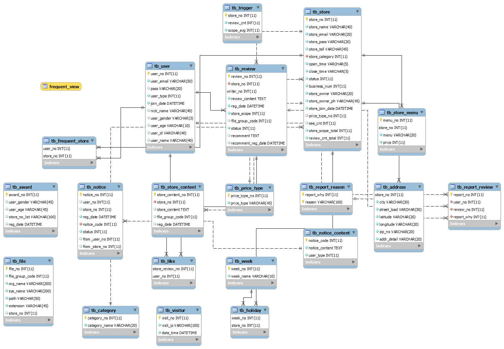
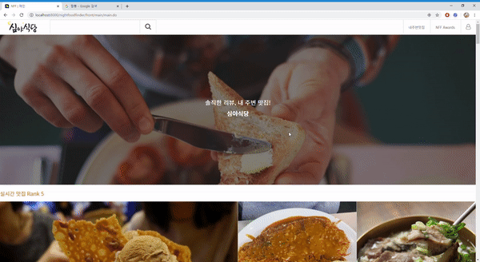
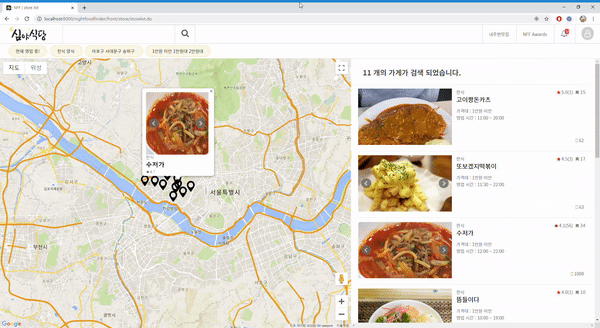
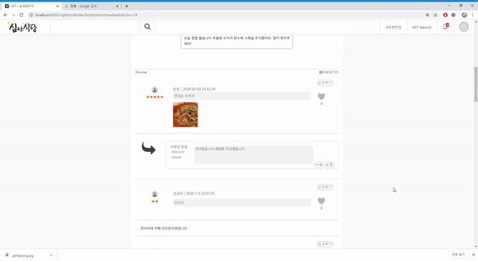
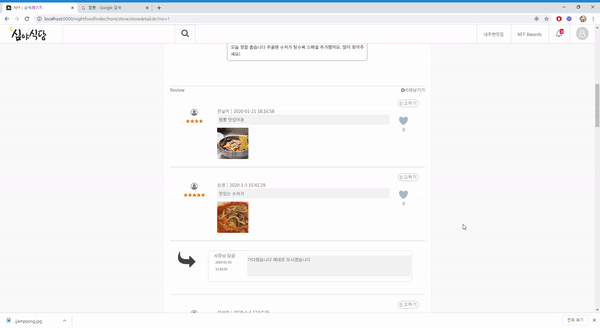

## [2019.10~2019.12] 심야식당
*현재 영업 중 인 식당의 정보를 
접속 위치 기반으로 여러 조건에 맞게 제공하는 웹 서비스*

## 주요 기술
- Java, JSP, JSTL, EL
- jQuery, Ajax, JSON
- HTML, CSS, Javascript, BootStrap, jQueryPlugin
- mysql, mybatis
- google map API, KAKAO login API,  Naver login API

## ERD

## 메인

## 로그인

## 검색(리스트)

## 상세 페이지

## 댓글

## 좋아요/신고

