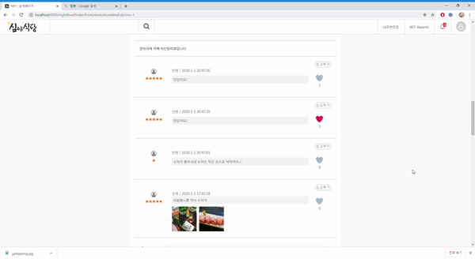

## [2019.10~2019.12] 심야식당
*현재 영업 중 인 식당의 정보를 
접속 위치 기반으로 여러 조건에 맞게 제공하는 웹 서비스*

## 주요 기술
- Java, JSP, JSTL, EL
- jQuery, Ajax, JSON
- HTML, CSS, Javascript, BootStrap, jQueryPlugin
- mysql, mybatis
- google map API, KAKAO login API,  Naver login API

## ERD

## 메인

- 현재시각 기준 영업중이며 평점순으로 상위 5개 맛집 제공.   
- 다양한 조건으로 구성된 맛집 리스트 제공   

## 로그인
   
- 소셜로그인 및 자체 로그인 구현   

   
- 네이버 로그인 API, 카카오 로그인 API   

## 검색(리스트)

- 조건을 선택하여 가게를 검색 가능.   
- 가게 위치를 지도상의 마커로 표시.   

## 상세 페이지
   
- 가게정보(가게이름, 평점, 영업정보 등)   
- 단골등록 여부   

## 댓글
   
- 댓글 작성 시 이미지 업로드 가능   

## 좋아요/신고

- 좋아요   

- 신고   
